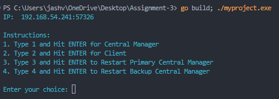

<div align="center" style="font-size: 20px;">

### Assignment 3

**Jash Jignesh Veragiwala (1006185)**

</div>

---

## Q1

Develop a basic Ivy architecture for a distributed shared memory (DSM) system. Implement a Central Manager (CM) to oversee and coordinate read and write requests. Allow clients to perform read and write operations on pages managed by the Central Manager.

## Features

- Distributed shared memory model
- Central Manager controls page access
- Clients can:
  - Request to read a page
  - Request to write to a page
- Maintain page consistency through invalidation and forwarding mechanisms
- Support multiple clients accessing shared pages

## Requirements

- **Go**: Ensure that Go is installed (version 1.13+ recommended).
- github.com/fatih/color package: `go install github.com/fatih/color`

## Program Structure

- Components:

  - Client
  - Central Manager
  - Message passing system using RPC

- Key Structs:

  - `Client`: Represents a node in the distributed system
  - `CentralManager`: Manages page metadata and coordinates requests
  - `Page`: Represents a shared memory page
  - `Message`: Defines communication protocol between nodes

### Node Structure

- `Client`:

  - ID
  - IP Address
  - Page Copy Set
  - Central Manager IP

- `CentralManager`:

  - IP Address
  - Metadata of pages
  - Page ownership information

### Message Structure

- Read Request
- Read Forward
- Page Send
- Read Confirmation
- Write Request
- Invalidate Copy
- Write Forward
- Write Confirmation

### Core Mechanism

1. Client sends read/write request to Central Manager
2. Central Manager validates and forwards request
3. Page owner responds with page content
4. Central Manager updates page metadata
5. Clients maintain local page copies with consistent state

### Main Program Flow

1. Initialize Central Manager
2. Initialize Clients
3. Clients send read/write requests
4. Central Manager coordinates page access
5. Maintain page consistency through invalidation

## Q2 (Fault-Tolerant Ivy Architecture)

Enhance the basic Ivy architecture to include fault tolerance features. Introduce a backup Central Manager to ensure system reliability. Develop a protocol to maintain consistency in metadata across the system. Implement mechanisms to handle failures of the primary Central Manager and facilitate its recovery.

## Features

- Backup Central Manager
- Metadata synchronization between primary and backup
- Failover mechanism
- Restoration of system state after primary CM failure

## Program Structure

- Additional Components:

  - Primary Central Manager
  - Backup Central Manager
  - Heartbeat/Pulse mechanism

- Extended Structs:

  - CentralManager with primary/backup flag
  - Enhanced message types for failover

### Node Structure

- CentralManager:

  - IP Address
  - Metadata of pages
  - Primary/Backup flag
  - Mechanism to check primary CM health

### Message Structure

- Additional message types:

  - Pulse
  - Change Central Manager
  - Recovered

### Core Mechanism

1. Primary Central Manager sends periodic heartbeats
2. Backup CM monitors primary CM's health
3. If primary CM fails, backup takes over
4. Restore system state and metadata
5. Notify clients about Central Manager change

### Main Program Flow

1. Initialize Primary Central Manager
2. Initialize Backup Central Manager
3. Periodic health checks
4. Failover on primary CM failure
5. Restore system state
6. Continue serving client requests

## User Input and Output Explanation

### Available Commands

**Central Manager**

- `data`: Display current metadata


**Client**

- `readpg <pageNo>`: Read a specific page
  - Example: `readpg P1`
- `writepg <pageNo> <content>`: Write content to a page
  - Example: `writepg P1 Content1`
- `print`: Display current Page Copy Set
- `seed`: Seed initial pages
- `run`: Generate 10 random read/write requests (must be entered on all the client terminals)


## Output Color Codes

- Cyan (System Messages): General system information
- Red (Error Messages): Errors and failure scenarios
- Yellow (Warning Messages): Potential issues or warnings
- Green (Receive Messages): Received message notifications
- Blue (Send Messages): Sent message notifications

## Compilation and Execution for Q1 and Q2

### Steps

1. Remove Existing Data
   - `remove centralmanager.json and clients.json files if present`
2. Initialize the Project:
   ```bash
   go mod init myproject
   ```
3. Install Dependencies:
   ```bash
   go install github.com/fatih/color
   go mod tidy
   ```
4. Clean and Build:
   ```bash
    go clean
    go build
   ```
5. Run the Program:
   ```bash
    go build; ./myproject.exe
   ```

## Running the different types of Nodes

1. After Running the Program you will be shown instructions to choose one of the following options:

   

2. `Type 1` to create a `Central Manager`. This will create a new centralmanager.json file and add the primary CentralManager object to the file. The primary CM should now be running.

3. `Type 1` again for the `2nd time` to create a `Backup Central Manager`. This will see that a primary CentralMananger already exists in centralmanager.json and add a Backup CentralManager object to the file. The Backup CM should now be running.

4. `Type 2` to create a `Client`. This will check client.json and add Client (currentHighestID + 1) to the file. The Client should now be running.

5. `Type 3` to make the Primary Central Manager join back to the network, if it had left the network py pressing `Ctrl+C`.

6. `Type 4` to make the Backup Central Manager join back to the network, if it had left the network py pressing `Ctrl+C`.

## How to kill any Node (PrimaryCM/BackupCM/Client)

To kill any node simply go to its terminal and press `ctrl+c`

## How to reboot a CM (PrimaryCM/BackupCM)

- To reboot a PrimaryCM run:
  ```bash
  go build; ./myproject.exe
  ```
  - In the menu option `type 3`. This checks centralmanager.json for the IP of the original Primary CentralManager and runs the CentralManager on that IP.
- To reboot a Backup CentralManager:
  ```bash
  go build; ./myproject.exe
  ```
  - In the menu option `type 4`. This checks centralmanager.json for the IP of the original Backup Primary Central Manager and runs the Backup Central Manager on that IP.

## Different types of interactive simulations

### Type 1 (Manual request generating - one at a time)

The default state of stimulation where you can handle each and every read/write from different clients.

This type of simulation doesn't output the time taken to complete the request as the requests made is as per the demand of the user and could be unlimited.

### Type 2 (Random request generation - 10 request from random clients)

To run this simulation you must type `run` in all the client terminal after the program has started. This will generate 10 random read/write requests from each client after 60 seconds of typing the command, allowing us to switch between the terminals to type the `run` command.

## Q3

Sequential consistency ensures a total ordering of read and write operations across all clients such that operations appear to be executed in a single sequential order consistent with each client’s program order. In the Ivy architecture, this principle is preserved through the following mechanisms:

### Reads:

1. Local Cache Check:

   - A client first checks its local cache for the required page.
   - If the page exists, it indicates no other node has performed a write, as any write would have invalidated the cache. The client can safely read the latest available version of the page.

2. Handling Invalidations:

   - When a page is invalidated, the CM forwards the read request to the owner of the page, who has the latest written copy.
   - As per the protocol, the owner is always updated during a write request, ensuring that the most recent version is served.
   - This guarantees that read requests are forwarded to the correct owner who holds the latest copy.

### Writes:

1. Write Ordering via Central Manager:
   - The CM maintains a queue of write requests, processing them one at a time. This ensures a total ordering of writes based on the order in which they are received by the CM.
   - During invalidations, the CM waits for acknowledgments from all affected clients before proceeding with the write.
   - Only after receiving all invalidation confirmations does the CM forward the write to the owner.

### Handling Primary CM Failure:

The fault-tolerant Ivy architecture introduces a backup CM to handle failures. The behavior under different scenarios is analyzed below:

**Case 1:** Primary CM fails after completing the last request; backup has synced metadata. This transition is seamless. The backup CM takes over using the most up-to-date metadata, ensuring no inconsistency.

**Case 2:** Primary CM fails before completing the last request; backup has synced metadata. The last request may be lost, but clients can re-request after a timeout if they do not receive a response (e.g., PAGE_SEND). This can be handled with proper timeout mechanisms.

**Case 3:** Primary CM fails after completing the last request; backup metadata is outdated. Clients assume the request is complete based on received responses. However, the backup CM does not reflect the update, leading to potential inconsistencies. This requires enhanced synchronization between the primary and backup CMs.

**Case 4:** Primary CM fails before completing the last request; backup metadata is outdated. Similar to Case 2, the request can be retried by the client after a timeout to ensure completion.

Hence sequential consistency is preserved as the Central Manager (CM) ensures a total ordering of read and write requests, and this ordering is seamlessly inherited by the backup CM during a failover. This guarantees that all clients perceive the same logical sequence of operations, even in the event of primary CM failure. The system's design ensures that the transition between the primary and backup CM does not disrupt the consistency of operations.

Mechanisms like invalidation acknowledgments, write-forwarding, and consistent updates to ownership further reinforce this guarantee by ensuring that the most up-to-date data is always accessed. These processes prevent any client from reading stale data, maintaining the integrity of sequential consistency across all operations.

Even in cases of transient failures, synchronization between the primary and backup CMs, coupled with client retry mechanisms, ensures that any temporary disruptions are resolved without breaking the overall consistency. While minor inconsistencies could theoretically arise due to incomplete metadata synchronization, frequent and reliable data updates between the primary and backup CMs significantly reduce this risk. Thus, the fault-tolerant Ivy architecture effectively upholds sequential consistency in most scenarios.

<br><br><br>

# Experiments

### Experiment 1

Without any faults, compare the performance of the basic version of Ivy protocol
and the new fault tolerant version using requests from at least 10 clients. In this question, the
requests could be read or write, randomized.

# Performance Comparison

| Client             | Client 1 | Client 2 | Client 3 | Client 4 | Client 5 | Client 6 | Client 7 | Client 8 | Client 9 | Client 10 | Average Time (ms) |
| ------------------ | -------- | -------- | -------- | -------- | -------- | -------- | -------- | -------- | -------- | --------- | ----------------- |
| IVY                | 1003     | 1006     | 1004     | 1003     | 1005     | 1004     | 1007     | 1006     | 1005     | 1006      | 1004.9            |
| Fault Tolerant IVY | 1004     | 1006     | 1018     | 1006     | 1006     | 1007     | 1005     | 1003     | 1003     | 1002      | 1006              |


### Experiment 2

Without any faults, compare the performance of the basic version of Ivy protocol
and the new fault tolerant version using requests from at least 10 clients. In this question,
evaluate the performance for read-intensive workload (e.g., 90% reads and 10% writes) and
then for write-intensive workload (e.g., 90% writes and 10% reads).

To change the workload of the request, go to the `client.go` file and uncomment the appropriate `reqGenerator()` function sections as shown below:


# Performance Comparison: Read-Write Operations

## 90% Read - 10% Write

| Client                           | Client 1 | Client 2 | Client 3 | Client 4 | Client 5 | Client 6 | Client 7 | Client 8 | Client 9 | Client 10 | Average Time (ms) |
| -------------------------------- | -------- | -------- | -------- | -------- | -------- | -------- | -------- | -------- | -------- | --------- | ----------------- |
| IVY (90 R - 10 W)                | 1004     | 1015     | 1003     | 1003     | 1005     | 1002     | 1003     | 1004     | 1003     | 1002      | 1004.4            |
| Fault Tolerant IVY (90 R - 10 W) | 1003     | 1002     | 1004     | 1003     | 1003     | 1003     | 1004     | 1003     | 1013     | 1013      | 1005.1            |

## 10% Read - 90% Write

| Client                           | Client 1 | Client 2 | Client 3 | Client 4 | Client 5 | Client 6 | Client 7 | Client 8 | Client 9 | Client 10 | Average Time (ms) |
| -------------------------------- | -------- | -------- | -------- | -------- | -------- | -------- | -------- | -------- | -------- | --------- | ----------------- |
| IVY (10 R - 90 W)                | 1018     | 1005     | 1006     | 1006     | 1015     | 1006     | 1005     | 1007     | 1006     | 1005      | 1007.9            |
| Fault Tolerant IVY (10 R - 90 W) | 1006     | 1006     | 1006     | 1007     | 1005     | 1006     | 1007     | 1008     | 1006     | 1007      | 1006.4            |


### Experiment 3

Evaluate the new design in the presence of a single fault – one CM fails only once. Specifically, you can simulate two scenarios a) when the primary CM fails at a random time, and b) when the primary CM restarts after the failure. Compare the performance of these two
cases with the equivalent scenarios without any CM faults.

**a)**

**Primary CM terminal**


**Backup CM terminal**


**One of the Client terminal**


**b)**

**Primary CM Terminal**


**Backup CM terminal**


**One of the Client terminal where the request was already fulfilled by the primary CM**


**One of the Client terminal where the request was getting fulfilled by the primary CM but then it failed so it was fulfilled by the backup CM**


**One of the Client terminal where the request was made and fulfilled by the primary CM once it was back alive**


# Experiment 3: Performance with CM Failures

| Scenario                | Client 1 | Client 2 | Client 3 | Client 4 | Client 5 | Client 6 | Client 7 | Client 8 | Client 9 | Client 10 | Average Time (ms) |
| ----------------------- | -------- | -------- | -------- | -------- | -------- | -------- | -------- | -------- | -------- | --------- | ----------------- |
| CM fails at random time | 1004     | 1006     | 1006     | 3049     | 1004     | 1004     | 1004     | 1003     | 1006     | 1005      | 1209.1            |
| CM fails and comes back | 1006     | 1004     | 1007     | 3040     | 1002     | 1003     | 1004     | 1005     | 1004     | 1003      | 1207.8            |
| Fault Tolerant IVY      | 1004     | 1006     | 1018     | 1006     | 1006     | 1007     | 1005     | 1003     | 1003     | 1002      | 1006              |


### Experiment 4

Evaluate the new design in the presence of multiple faults for primary CM – primary CM fails and restarts multiple times. Compare the performance with respect to the equivalent scenarios without any CM faults

**Primary CM terminal (left and joined network twice)**


**BackUp CM terminal handling the requests when the Primary CM was down**


**Client terminal whose request was fulfilled before the Primary CM left the network for the 1st time**


**Client whose request was handled by the Backup CM when the Primary CM was down**


**Client whose request was handled by the Primary CM once it was back alive.**


**Client whose request was handled by Backup CM when the Primary CM was down the 2nd time**


**Client whose request was handled by the Primary CM once it was back alive for the 2nd time**


# Experiment 4: Performance with Multiple CM Failures

| Scenario                               | Client 1 | Client 2 | Client 3 | Client 4 | Client 5 | Client 6 | Client 7 | Client 8 | Client 9 | Client 10 | Average Time (ms) |
| -------------------------------------- | -------- | -------- | -------- | -------- | -------- | -------- | -------- | -------- | -------- | --------- | ----------------- |
| CM fails and comes back multiple times | 1002     | 1002     | 3055     | 1004     | 1004     | 1002     | 3044     | 1004     | 1002     | 1005      | 1412.4            |
| Fault Tolerant IVY                     | 1004     | 1006     | 1018     | 1006     | 1006     | 1007     | 1005     | 1003     | 1003     | 1002      | 1006              |


### Experiment 5

Evaluate the new design in the presence of multiple faults for primary CM and
backup CM – both primary CM and backup CM fail and restart multiple times. Compare the performance with respect to the equivalent scenarios without any CM faults.

**Primary CM terminal (left and joined network twice)**


**Backup CM terminal (left and joined network twice)**


**The client terminals are similar to the previous part as the request are handled by the Primary or the Backup CM whichever is available at a given time.**

# Experiment 5: Performance with Primary and Backup CM Failures

| Scenario                                                  | Client 1 | Client 2 | Client 3 | Client 4 | Client 5 | Client 6 | Client 7 | Client 8 | Client 9 | Client 10 | Average Time (ms) |
| --------------------------------------------------------- | -------- | -------- | -------- | -------- | -------- | -------- | -------- | -------- | -------- | --------- | ----------------- |
| Primary and Backup CM fails and comes back multiple times | 1003     | 3042     | 1003     | 1005     | 1003     | 1005     | 3060     | 1003     | 1006     | 1005      | 1413.5            |
| Fault Tolerant IVY                                        | 1004     | 1006     | 1018     | 1006     | 1006     | 1007     | 1005     | 1003     | 1003     | 1002      | 1006              |


